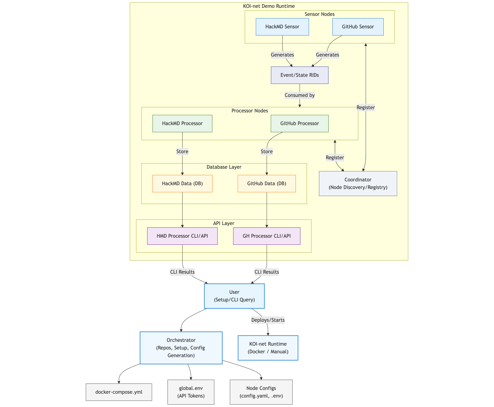
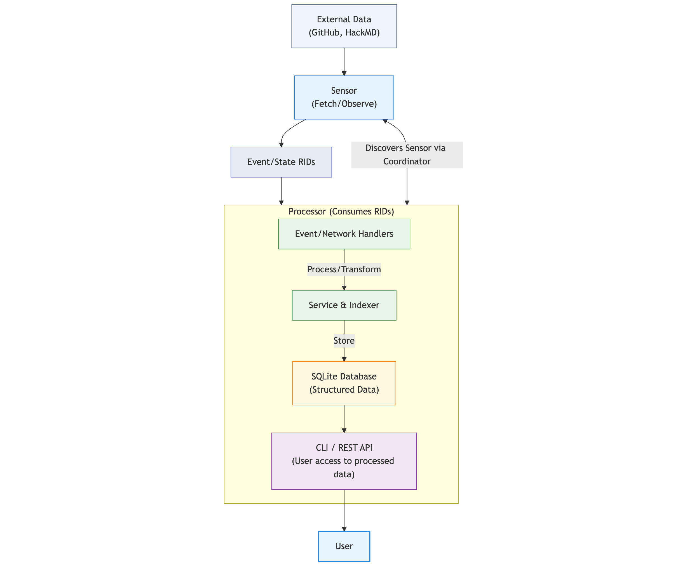

# KOI-net Demo

[](https://www.python.org/downloads/)
[](https://www.docker.com/)
[](https://opensource.org/licenses/MIT)

## Overview

KOI-net Demo is a **demonstration platform** showcasing a modular, event-driven microservice architecture that processes GitHub and HackMD data. It showcases how distributed nodes can discover, communicate, and process data from external sources in a loosely coupled system. This demo features a powerful orchestration layer that simplifies deployment and management of the entire network. This is a proof-of-concept system designed for educational purposes, not production use.

**What This Demo Illustrates:**

- Microservice architecture principles with decoupled components
- Event-driven communication patterns
- Distributed data processing workflows
- Automated deployment and configuration generation

**Key Demo Features:**

- Automated repository cloning and setup
- Dynamic configuration generation for local and Docker deployments
- Centralized command-line interface for system management
- Decoupled nodes communicating via a Coordinator

The demo shows data flow from external sources through sensor nodes, via a coordinator, to processor nodes where data is stored and made accessible through CLI tools.

### Demo Architecture



**How This Demo Works:**

1. **Orchestration**: Users interact with setup tools to deploy demonstration nodes
2. **Runtime Components**:
   - Coordinator manages node discovery and registration
   - Sensors collect data from GitHub and HackMD APIs
   - Processors transform and store data for analysis
   - All components use RID (Resource Identifier) exchange



**Demo Data Flow:**

1. **Collection**: Sensor nodes fetch external data from GitHub and HackMD
2. **Discovery**: Sensors register with the Coordinator for system-wide visibility
3. **Exchange**: RIDs facilitate standardized event communication
4. **Processing**: Data moves through event handlers to services
5. **Storage**: Processed data is indexed in structured databases
6. **Access**: CLI and REST interfaces provide query capabilities
7. **Monitoring**: Continuous updates create a live processing stream

### Demo Node Architecture

This demonstration uses specialized nodes in a decentralized, event-driven architecture:

**Coordinator Node (Port 8080)**

- Central registry for service discovery
- Enables dynamic node registration
- Maintains network topology
- First node to start in the system

**Sensor Nodes**

- **GitHub Sensor (Port 8001)**: Monitors repositories, generates event RIDs
- **HackMD Sensor (Port 8002)**: Tracks note changes, creates event RIDs

**Processor Nodes**

- **GitHub Processor (Port 8011)**: Consumes GitHub events, indexes repository data
- **HackMD Processor (Port 8012)**: Processes note content, enables search and history tracking

Each node operates independently with its own configuration, database, and API.

## Prerequisites

- Python 3.12+
- Docker and Docker Compose v2+ (for Docker deployment)
- Git
- Make (optional, see Implementation Details for alternatives)

> **Note:** This demo has been tested primarily on macOS systems. While it should work on other platforms, some commands or behaviors might differ slightly on Linux or Windows.

## Running the Demo

### Option 1: Docker Setup (Recommended for Demo)

```bash
# All-in-one command to set up, build, and start the KOI-net demo
make docker-demo
```

This will:

1. Clean the environment
2. Generate Docker configurations
3. Build all containers
4. Start all services
5. Verify service health
6. Display system status

For manual demo setup:

```bash
# Generate Docker configurations
make demo-orchestrator

# Build and start all services in detached mode
docker compose up -d

# Stop all services
make down
```

### Option 2: Local Development Setup

#### Using Make

```bash
# Clone repositories and generate configurations
make setup-all

# Run nodes (each in a separate terminal)
make coordinator
make github-sensor
make hackmd-sensor
make github-processor
make hackmd-processor

# Run CLI tools
make hackmd-processor-cli
make github-processor-cli
```

#### Using the CLI Tool

```bash
# Clone repositories and generate configurations
python cli.py setup-all

# Run nodes (each in a separate terminal)
python cli.py coordinator
python cli.py github-sensor
python cli.py hackmd-sensor
python cli.py github-processor
python cli.py hackmd-processor

# Run CLI tools
python cli.py hackmd-cli
python cli.py github-cli

# Show available commands
python cli.py --help
```

## API Token Setup

Before running the demo, add your API tokens to the `global.env` file in the project root:

```bash
# Edit the global.env file
nano global.env
```

Add these environment variables:

```
# GitHub Personal Access Token
GITHUB_TOKEN=your_github_token_here

# GitHub Webhook Secret (any random string)
GITHUB_WEBHOOK_SECRET=your_webhook_secret_here

# HackMD API Token
HACKMD_API_TOKEN=your_hackmd_token_here
```

## Port Configuration

The demonstration uses consistent port mapping across deployment modes:

```
- Coordinator: 8080
- GitHub Sensor: 8001
- HackMD Sensor: 8002
- GitHub Processor: 8011
- HackMD Processor: 8012
```

View current port assignments:

```bash
make show-ports
```

## CLI Tools

The KOI-net demo provides CLI tools for data exploration.

### GitHub CLI Commands

```bash
# List tracked repositories
make demo-github-cli
# or directly:
docker compose exec github-processor python -m cli list-repos

# View event summary
docker compose exec github-processor python -m cli summary

# Show repository events
docker compose exec github-processor python -m cli show-events BlockScience/koi-net

# Add repository to track
docker compose exec github-processor python -m cli add-repo BlockScience/koios

# View event details
docker compose exec github-processor python -m cli event-details <event_rid>
```

### HackMD CLI Commands

```bash
# List all notes
make demo-hackmd-cli
# or directly:
docker compose exec hackmd-processor python -m cli list

# Display note statistics
docker compose exec hackmd-processor python -m cli stats

# View a specific note
docker compose exec hackmd-processor python -m cli show C1xso4C8SH-ZzDaloTq4Uw

# Show note history
docker compose exec hackmd-processor python -m cli history C1xso4C8SH-ZzDaloTq4Uw

# Search notes by content
docker compose exec hackmd-processor python -m cli search "koi-net"

# Filter notes
docker compose exec hackmd-processor python -m cli list --limit 10 --search koi
```

### Individual Services

```bash
# Start individual demo services
make demo-coordinator
make demo-github-sensor
make demo-hackmd-sensor
make demo-github-processor
make demo-hackmd-processor

# Rebuild Docker images (no cache)
make docker-rebuild
```

## Environment Management

```bash
# Clean up all environments and artifacts
make clean

# Clean only cache directories
make clean-cache

# Clean only virtual environments
make clean-venv

# Kill processes using KOI-net demo ports
make kill-ports
```

## Troubleshooting

If you encounter "No repositories found" or "No notes found" in the demo:

1. Check service health: `make docker-status`
2. View logs for errors: `make docker-logs`
3. Verify API tokens in `global.env`
4. Allow time for initial data synchronization

### Common Issues

- **Authentication errors**: Check your API tokens. GitHub token needs `repo` and `read:org` scopes.
- **Missing repositories**: Add repositories manually with `docker compose exec github-processor python -m cli add-repo owner/repo`.
- **No HackMD notes**: Ensure your HackMD API token has workspace access.
- **Health check failures**: Services may take time to initialize. Check logs with `make docker-logs`.
- **"Unknown filter health" error**: Update Docker Compose or use `docker ps` to check container status.
- **Port conflicts**: Run `make kill-ports` to free KOI-net demo ports.

## Implementation Details

This demonstration uses three main components:

1. `orchestrator.py`: Handles cloning, configuration, and Docker setup
2. `Makefile`: Provides command targets
3. `docker-compose.yml`: (Generated) Defines service configuration

## Docker Technical Details

- Uses Python 3.12 slim base image
- Installs dependencies from requirements.txt
- Configures networking and health checks
- Preserves API tokens between runs
- Regenerates configurations automatically

### Environment Variables

| Variable                | Purpose                      | Required by                     |
| ----------------------- | ---------------------------- | ------------------------------- |
| `GITHUB_TOKEN`          | GitHub Personal Access Token | GitHub Sensor, GitHub Processor |
| `GITHUB_WEBHOOK_SECRET` | Webhook validation secret    | GitHub Sensor                   |
| `HACKMD_API_TOKEN`      | HackMD API access token      | HackMD Sensor, HackMD Processor |

### Demo Database Locations

- GitHub event database: `/app/.koi/index.db` in the github-processor container
- HackMD note database: `/app/.koi/index.db` in the hackmd-processor container
