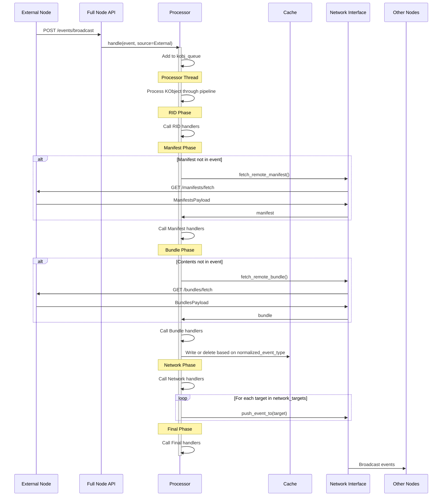
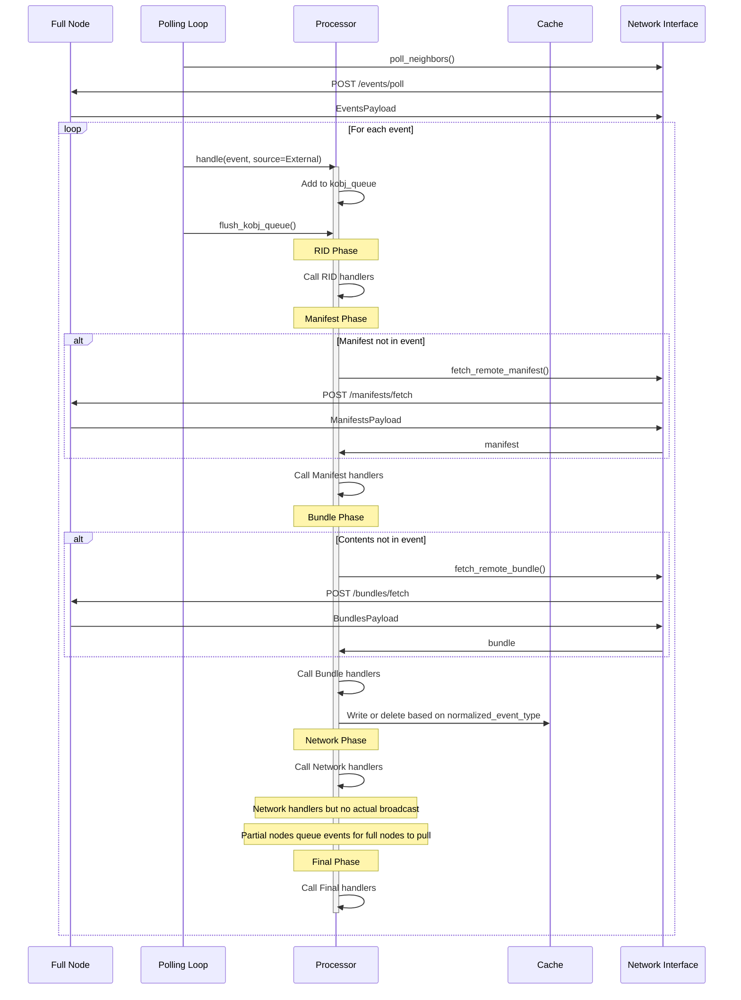

# KOI-net Architecture and Design

This document describes the architecture and design principles of KOI-net, with a focus on the processing pipeline and data model.

## Knowledge Processing Pipeline

At the core of KOI-net is a knowledge processing pipeline that handles all knowledge as it moves through the system. This pipeline consists of five distinct phases, each with specialized handlers that can influence how knowledge is processed.

### 1. RID Phase

The first phase processes the Resource Identifier (RID), which uniquely identifies the knowledge object.

**Input:** Knowledge object with:
- RID
- Source (Internal/External)
- (Optional) Event type
- (Optional) Manifest
- (Optional) Contents

**Process:**
- Handlers can filter or modify the knowledge object
- If event type is FORGET, the node will retrieve the bundle from local cache
- If event type is not FORGET, the node will try to retrieve or validate the manifest

**Exit Conditions:**
- Continue to next phase if no handler returns STOP_CHAIN
- Exit immediately if any handler returns STOP_CHAIN

### 2. Manifest Phase

The second phase processes the knowledge object with its manifest.

**Input:** Knowledge object with:
- RID
- Manifest (guaranteed)
- Source
- Event type

**Process:**
- Handlers can filter or modify the knowledge object
- Node attempts to retrieve or validate the bundle (manifest + contents)

**Exit Conditions:**
- Continue to next phase if no handler returns STOP_CHAIN
- Exit immediately if any handler returns STOP_CHAIN

### 3. Bundle Phase

The third phase processes the complete knowledge bundle.

**Input:** Knowledge object with:
- RID
- Manifest
- Contents
- Source
- Event type

**Process:**
- Handlers can decide what happens to this knowledge in the cache
- Handlers set normalized_event_type to determine cache action:
  - NEW or UPDATE → Write to cache
  - FORGET → Delete from cache
  - None → No cache action

**Exit Conditions:**
- Continue to next phase if no handler returns STOP_CHAIN
- Exit immediately if any handler returns STOP_CHAIN
- Exit if normalized_event_type remains None

**Action:**
- Cache operation based on normalized_event_type
- Network graph update if the RID is a KoiNetNode or KoiNetEdge

### 4. Network Phase

The fourth phase determines how to share the knowledge with other nodes.

**Input:** Knowledge object with:
- RID
- Manifest
- Contents
- Source
- Event type
- Normalized event type (guaranteed to be set)

**Process:**
- Handlers determine which nodes to broadcast this knowledge to
- Handlers update network_targets set with node RIDs

**Exit Conditions:**
- Continue to next phase if no handler returns STOP_CHAIN
- Exit immediately if any handler returns STOP_CHAIN

**Action:**
- Queue normalized events for each target node
- Flush webhook queues for immediate sending

### 5. Final Phase

The last phase provides a hook for final actions.

**Input:** Knowledge object with:
- RID
- Manifest
- Contents
- Source
- Event type
- Normalized event type
- Network targets

**Process:**
- Handlers can take any final actions
- No decisions to make that affect later phases

**Exit Conditions:**
- Pipeline completes regardless of handler returns

## Processing Flow Diagrams

### Event Flow Through a Full Node

### Event Flow Through a Partial Node

## Data Model

KOI-net builds on the Resource Identifier (RID) protocol to create a foundation for knowledge exchange. The data model consists of five main types:

### RID (Resource Identifier)

A unique identifier for any resource in the system.

**Format:** `orn:<namespace>:<type>:<identifier>`

**Examples:**
- `orn:koi-net.node:my_node+12345678-1234-5678-1234-567812345678`
- `orn:my-app:document:report-2023`

RIDs provide a globally unique way to identify any type of resource, making them the foundation of the KOI-net system.

### Manifest

A portable descriptor of a data object associated with an RID.

**Fields:**
- `rid: RID` - The RID of the resource
- `timestamp: datetime` - When the manifest was created
- `sha256_hash: str` - Hash of the contents

Manifests enable nodes to compare versions of knowledge and determine if they need to fetch updated content.

### Bundle

A complete knowledge object, combining a manifest with content.

**Fields:**
- `manifest: Manifest` - The manifest describing the resource
- `contents: dict` - The actual content/data

Bundles are what get stored in a node's cache and represent the actual knowledge that nodes exchange.

### Event

A signaling construct that conveys information about RID objects between nodes.

**Fields:**
- `rid: RID` - The RID of the resource
- `event_type: EventType` - NEW, UPDATE, or FORGET
- `manifest: Manifest | None` - Optional manifest
- `contents: dict | None` - Optional contents

Events notify other nodes about changes to knowledge. The "FUN" event types correspond to:
- **F**ORGET - The node has deleted this knowledge
- **U**PDATE - The node has updated this knowledge
- **N**EW - The node has discovered new knowledge

### KnowledgeObject

An internal representation used during processing.

**Fields:**
- `rid: RID` - The RID of the resource
- `manifest: Manifest | None` - The manifest (may be None)
- `contents: dict | None` - The contents (may be None)
- `event_type: EventType | None` - Original event type
- `source: KnowledgeSource` - Internal or External
- `normalized_event_type: EventType | None` - Event type from this node's perspective
- `network_targets: set[KoiNetNode]` - Nodes to broadcast to

Knowledge objects combine all the information needed during processing and add fields that track the state of processing.

## Special RID Types

KOI-net defines two special RID types for its own operation:

### KoiNetNode

Represents a node in the network.

**Format:** `orn:koi-net.node:<name>+<uuid>`

**Content:** `NodeProfile` containing:
- `base_url: str | None` - For full nodes, the base URL
- `node_type: NodeType` - FULL or PARTIAL
- `provides: NodeProvides` - RID types the node provides

### KoiNetEdge

Represents a connection between two nodes.

**Format:** `orn:koi-net.edge:<source_uuid>:<target_uuid>`

**Content:** `EdgeProfile` containing:
- `source: KoiNetNode` - Source node RID
- `target: KoiNetNode` - Target node RID
- `edge_type: EdgeType` - WEBHOOK or POLL
- `status: EdgeStatus` - PROPOSED or APPROVED
- `rid_types: list[RIDType]` - RID types allowed on this edge

These special RID types enable the network to self-organize and maintain a graph of connections between nodes.

## Communication Patterns

KOI-net supports two main communication patterns:

### Event Communication (One-way)

- **Webhook**: Full nodes send events to other full nodes by calling their API endpoints
- **Polling**: Partial nodes retrieve events by polling full nodes

### State Communication (Two-way)

- **Fetch RIDs**: Get a list of RIDs from another node
- **Fetch Manifests**: Get manifests for specific RIDs or RID types
- **Fetch Bundles**: Get complete bundles for specific RIDs

Full nodes implement all five API endpoints, while partial nodes can only consume these endpoints, not provide them.

## Design Principles

KOI-net's architecture reflects several key design principles:

1. **Autonomy**: Each node makes its own decisions about what knowledge to accept, store, and share.

2. **Flexibility**: The handler-based processing pipeline allows for customization at every phase.

3. **Interoperability**: The standardized protocol enables heterogeneous nodes to communicate.

4. **Fractal Structure**: Networks of nodes can act as a single node from an outside perspective.

5. **Self-Organization**: Nodes discover each other and negotiate connections autonomously.

These principles make KOI-net adaptable to a wide range of knowledge management scenarios while maintaining a consistent communication protocol. 