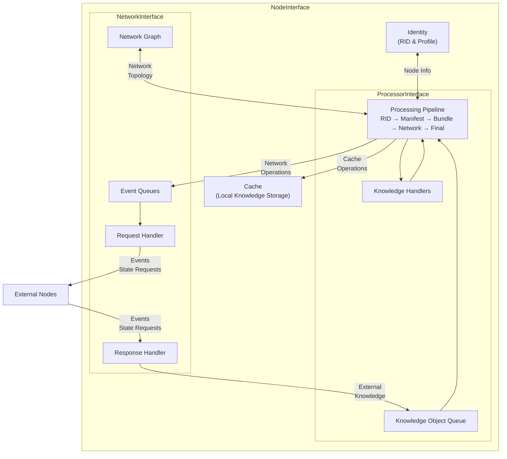

# KOI-net Project Overview

## What is KOI-net?

KOI-net is a protocol implementation that defines standard communication patterns and coordination norms needed to establish and maintain Knowledge Organization Infrastructure (KOI) networks. KOI-nets are heterogeneous compositions of KOI nodes, each capable of autonomously inputting, processing, and outputting knowledge.

The protocol is designed as a simple, flexible, but interoperable foundation for projects to build on. It governs communication between nodes, not how they operate internally. Networks of KOI nodes may act like a single node from an outside perspective, giving the system a fractal-like quality.

KOI-net builds upon the Resource Identifier (RID) protocol to identify and coordinate around knowledge objects.

## Key Components

### 1. NodeInterface

The central class that initializes and coordinates all other components. It manages:

- Identity (RID and profile)
- Cache (local knowledge storage)
- Network (communication with other nodes)
- Processor (knowledge handling pipeline)

The `NodeInterface` handles starting and stopping the node, which includes initializing network connections, processing knowledge objects, and performing handshakes with other nodes.

### 2. NetworkInterface

Handles all communication between nodes, providing methods to:

- Push events to other nodes
- Poll for events from other nodes
- Fetch remote bundles, manifests, and RIDs
- Manage the network graph (connections between nodes)

It contains three key subcomponents:

- `NetworkGraph`: Provides a view of the node's connections
- `RequestHandler`: Sends API requests to other nodes
- `ResponseHandler`: Processes incoming API requests

### 3. ProcessorInterface

Manages the node's knowledge processing pipeline, which includes:

- A queue of knowledge objects to process
- A collection of knowledge handlers
- Logic for passing knowledge through the processing phases

The processor runs knowledge objects through five distinct phases: RID → Manifest → Bundle → Network → Final, with different handlers potentially acting at each phase.

### 4. Knowledge Handlers

Custom functions that process knowledge objects at different stages of the pipeline. Handlers can:

- Filter or modify knowledge objects
- Decide whether to cache knowledge
- Determine which nodes should receive knowledge
- Take custom actions based on knowledge content

Handlers are organized by type (RID, Manifest, Bundle, Network, Final) and are executed in a chain for each knowledge object.

### 5. Knowledge Types

The system works with several fundamental knowledge types:

- **RID**: Resource Identifier, a unique ID for any resource
- **Manifest**: Metadata about a resource (RID, timestamp, hash)
- **Bundle**: A manifest plus the actual resource contents
- **Event**: An RID with an event type (NEW, UPDATE, FORGET)
- **KnowledgeObject**: Internal representation combining the above with processing metadata

## Data Flow Diagram

The diagram shows how data flows through a KOI-net node:

1. Knowledge enters the system (from external nodes or internal sources)
2. It's converted to a Knowledge Object and added to the processing queue
3. The processor runs the object through its pipeline phases
4. Handlers at each phase can affect how the knowledge is processed
5. The processor may write to the cache or queue events for network broadcast
6. Network operations are executed, sending knowledge to other nodes

This cycle repeats continuously as the node participates in the KOI network.
